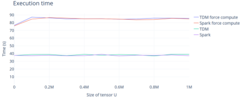

# Introduction
The goal of this experiment is to measure the overhead induced by the use of TDM operators compared to Spark DataFrame operators.

# TDM overview
TDM is a prototype aiming at developing the utilization of tensors connected to data sources for Big Data analytics. TDM Scala library is based on Spark DataFrames and uses shapeless to provide users with a type-safe implementation that is centered around dimensions' values instead of integer indexes.

The prototype can be found [here](https://github.com/AnnabelleGillet/TDM)

# Requirements
The experiment was run with the Jyputer notebook, using the [Scala Almond kernel](https://almond.sh/) and a PostgreSQL 9.1 database.

# Experiment context
To estimate the eventual overhead induced by TDM, we run an experiment in Spark and compare the result with the same experiment using TDM. The different phases are: 
* Building a tensor U with the users and the number of tweets published by each user as tensor's values, 
* Building a tensor UHT with the number of hashtags published by users for 1h time slices, 
* Performing a selection on tensor U to keep only users who have published at least 100 tweets, 
* Joining U and UHT to keep the values of UHT only for active users. 

We vary the size of tensor U from 0 to 1M elements by steps of 100 000. 

The experiments are carried out in two cases: 
* First by forcing the computation at each operation, 
* Second by forcing the execution only at the last operation in order to witness the optimization of Spark.

# Results
The results obtained are synthetized in the following figure. Each curve represents the average execution time over 5 run for each case.

The execution with TDM does not induce overhead compared to Spark, and the optimization capabilities of Spark are preserved.
